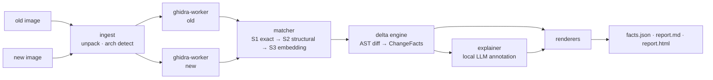

# fw-diff

[](https://github.com/dilates/fw-diff/actions/workflows/ci.yml)
[](LICENSE)

**Explain what changed between two firmware images — in plain English.**

fw-diff takes two firmware builds (ELFs, raw binaries, or packaged images), lifts both through
[Ghidra](https://ghidra-sre.org/) headless, matches functions across builds, computes a
**deterministic structural diff**, and then annotates every change with a security-aware,
human-readable explanation — using a **local LLM by default**. No cloud required.

```text
$ fw-diff explain fw-1.4.2.bin fw-1.4.3.bin --arch armv7 --base 0x40000000

  lifting    ██████████ fw-1.4.2  (1,910 functions, 3m12s)
  lifting    ██████████ fw-1.4.3  (1,912 functions, 3m05s)
  matching   ██████████ exact 1,681 · structural 118 · embedding 43 · unmatched 180

┌─ HIGH · parse_header 0x4001a3c0 → 0x4001a4f0 ─────────────────────────────────┐
│ New bound check inserted before memcpy (dst size 0x40 vs len).                │
│ Classifier: bound_change (evidence: cmp #0x40 added; caller of memcpy)        │
│ Hypothesis: CWE-190 fix — integer/bounds hardening. Confidence: medium.       │
└───────────────────────────────────────────────────────────────────────────────┘

  Changed 89 · Added 121 · Removed 28 · new crypto constants in 2 functions
  Reports: out/report.html · out/report.md · out/facts.json
```

## Why this exists

Every existing binary-diff workflow stops at *“these functions changed.”* Nobody tells you
**what changed, why it matters, or whether it is a security fix or a regression** — and none of
them work headless on symbol-less, multi-arch firmware inside CI.

| | fw-diff | BinDiff | Diaphora | Ghidra Version Tracking |
|---|---|---|---|---|
| Headless / CI-friendly | **yes (policy gates)** | no | partial | partial (GUI-bound) |
| Raw firmware, no symbols | **first-class** | weak | weak | manual effort |
| Multi-arch (ARM/MIPS/RISC-V/…) | **yes** | x86-centric | varies | yes |
| Natural-language explanations | **yes, local LLM** | no | no | no |
| Deterministic, reproducible output | **yes** | yes | partial | no |
| Offline / air-gapped | **default** | n/a | n/a | n/a |
| License | BSD-3-Clause | proprietary | GPL | Apache-2.0 |

## What you get

- **`facts.json`** — machine-readable diff facts. Deterministic: same inputs → byte-identical
  output. Safe to gate a release pipeline on.
- **`report.html`** — interactive side-by-side decompilation with per-change explanations,
  function graph, and evidence links.
- **`report.md`** — the changelog your patch notes were missing.
- **CLI policy engine** — fail CI on classes of change (`--fail-on bound_change,new_crypto`).

## How it works



The core design rule: **facts before narrative.** The deterministic diff engine is the source of
truth. The LLM only annotates facts it is handed and must cite evidence for every claim — it can
never invent a finding. See [ADR-0003](docs/adr/ADR-0003-facts-before-narrative.md).

## Quickstart

Zero-setup demo (bundled fixture IR — no Ghidra needed):

```bash
pipx install fw-diff
fw-diff demo --out out/          # full pipeline on a synthetic firmware pair
```

Real firmware (Ghidra 11.3+ required — tested against 11.3.2, Java 21):

```bash
pipx install 'fw-diff[ghidra]'
export GHIDRA_INSTALL_DIR=/opt/ghidra   # or the bundled wheel: pip install <ghidra>/Ghidra/Features/PyGhidra/pypkg/dist/pyghidra-*.whl
fw-diff doctor                          # verifies the environment

fw-diff explain fw-1.4.2.bin fw-1.4.3.bin --base 0x40000000
fw-diff ci fw-1.4.2.bin fw-1.4.3.bin --policy policy.yaml
```

Runs fully offline with any [Ollama](https://ollama.com)-served model; zero API keys needed.
Remote OpenAI-compatible endpoints are opt-in via `--llm-url`. All numeric gates: exit 0/1
(policy), 2 (config/ingest).

## Install

| Method | Command | Notes |
|---|---|---|
| pip / pipx | `pipx install fw-diff` | recommended for analysts |
| Docker | `docker run ghcr.io/dilates/fw-diff explain …` | worker sandboxing built in |
| from source | `uv sync && uv run fw-diff --help` | see [CONTRIBUTING](CONTRIBUTING.md) |

## Status

**v0.1.0a1 — implemented.** Deterministic core works end-to-end: ingest → Ghidra lift →
normalize → multi-stage match → delta → classifiers → facts/reports, plus the local-LLM
explain layer (evidence-validated). CI-tested with a byte-reproducibility gate.
See [docs/ROADMAP.md](docs/ROADMAP.md) for what's next (S3 embeddings, SARIF, docker
workers) and [docs/PRODUCT_SPEC.md](docs/PRODUCT_SPEC.md) for scope.

## Documentation

| Doc | What's in it |
|---|---|
| [Product spec](docs/PRODUCT_SPEC.md) | users, scope, success metrics |
| [Architecture](docs/ARCHITECTURE.md) | components, data model, process model |
| [Pipeline spec](docs/design/pipeline-spec.md) | normalization, matching, classifiers — the deep dive |
| [Report format](docs/design/report-format.md) | `facts.json` schema v1 |
| [ADRs](docs/adr/) | 10 recorded design decisions |
| [Threat model](docs/THREAT_MODEL.md) | untrusted-input posture, LLM guardrails |
| [Testing strategy](docs/testing-strategy.md) | synthetic firmware corpus, eval harness |
| [Getting started](docs/guides/getting-started.md) | walkthrough with real session output |

## Contributing

We treat this like a product: specs first, ADRs for every decision, corpus-driven tests.
Start with [CONTRIBUTING.md](CONTRIBUTING.md). Found a vulnerability in fw-diff itself? See
[SECURITY.md](SECURITY.md).

## License

BSD-3-Clause — see [LICENSE](LICENSE).
