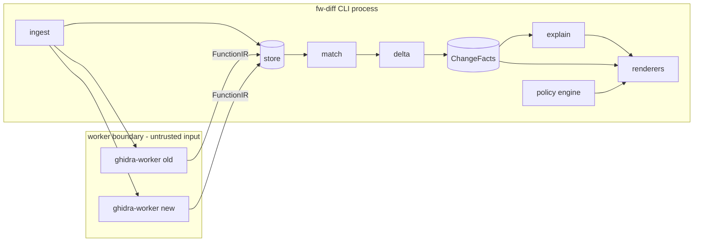

# Architecture

| | |
|---|---|
| **Status** | Approved for M1–M4 |
| **Owner** | Architecture |
| **Last updated** | 2026-09-29 |

## 1. Design principles

1. **Facts before narrative.** Deterministic diff facts are the single source of truth. The LLM
   is an annotation layer that must cite facts; it can be disabled, and when enabled its output
   is schema-validated. (ADR-0003)
2. **Local-first, offline-capable.** Firmware is confidential by default. Every stage must
   complete with no network. (ADR-0004)
3. **Reproducible or it didn't happen.** Same inputs + same versions → byte-identical
   `facts.json`. Enforced in CI.
4. **Untrusted input is sandboxed.** Firmware images are hostile files. Parsing happens in
   containerized workers by default in CI mode; resource caps everywhere. (ADR-0008)
5. **Zero-ops.** SQLite + on-disk blobs. No server, no daemon required. (ADR-0005, ADR-0010)
6. **Evidence everywhere.** Every claim in every report links to concrete evidence rows
   (edits, callgraph context, constants). Click-to-verify.

## 2. Component overview

| Component | Role | Language | Notes |
|---|---|---|---|
| `fw_diff.cli` | Entrypoint, orchestration, policy engine | Python 3.11+ | the only thing users touch |
| `fw_diff.ingest` | Format detect, unpack, arch detect, manifest | Python | binwalk-style heuristics + `file`/magic |
| `ghidra-worker` | Lift binaries → `FunctionIR` | Java/PyGhidra | in-process (default) or container mode |
| `fw_diff.match` | Multi-stage function matcher → `MatchSet` | Python (+Rust later) | S1/S2/S3 pipeline, ADR-0006 |
| `fw_diff.delta` | AST diff, edit clustering, classifiers → `ChangeFacts` | Python | deterministic core |
| `fw_diff.explain` | LLM annotation of facts | Python | provider-agnostic, optional |
| `fw_diff.report` | JSON / Markdown / HTML renderers (+SARIF v0.2) | Python | templates versioned |
| `fw_diff.store` | SQLite session DB + content-addressed blobs | Python | `~/.cache/fw-diff` |



## 3. Core data model

### 3.1 `FunctionIR` — one lifted function (JSON-serializable)

```jsonc
{
  "id": "F0042",                        // stable within a session
  "image": "new",                        // "old" | "new"
  "name": "FUN_4001a4f0",               // raw Ghidra name (may be symbol)
  "symbols": ["parse_header"],           // all discovered aliases
  "arch": "armv7",
  "addr": 1073924848,
  "size": 304,
  "params": 4,
  "pseudocode_raw": "...",               // as Ghidra emitted it
  "pseudocode_norm": "...",              // normalized (see pipeline-spec §3)
  "h_exact": "sha256:…",                 // normalized hash, constants preserved
  "h_struct": "sha256:…",                // normalized hash, constants wildcarded
  "embedding": [0.0, …],                 // optional, S3 stage
  "calls_out": ["F0051", "IMPORT_memcpy"],
  "calls_in": ["F0009", "F0127"],
  "strings": ["%s: header len %d"],
  "constants": [64, 305419896],          // numeric literals observed
  "imports_called": ["memcpy"],
  "meta": {"ghidra": "11.3.2", "decompiler": "decompileParameterId"}
}
```

### 3.2 `MatchSet` — function correspondences

One row per pair, with `match_method ∈ {exact_hash, struct_hash, callgraph_anchor,
embedding, manual}` and a calibrated `confidence ∈ [0,1]`. Ambiguity rule: S3 pairs are only
emitted when the top-2 candidate similarity gap ≥ δ (default 0.08); otherwise both sides are
flagged `ambiguous` and left unmatched for human mapping.

### 3.3 `ChangeFacts` — the deterministic deliverable

Per matched-but-changed pair: a list of **edits** (AST edit ops with old/new snippets), a list
of **classifier tags** with evidence pointers, context (affected callers/callees, strings,
constants of interest), and a **security relevance** score. Full schema:
[design/report-format.md](design/report-format.md). This is the artifact CI gates on and the
only thing the LLM is allowed to read besides trimmed pseudocode.

## 4. Process model

**Local mode (default):** one Python process. Ghidra lifting runs in-process via PyGhidra
(Ghidra 11.3+ bundles it). A `concurrent.futures` pool parallelizes lift/match stages across
both images. No network sockets opened except explicitly opt-in LLM endpoints.

**Container mode (`--worker-mode docker`):** the same pipeline split at the store boundary —
`ghidra-worker` images run as sandboxed containers (no network, read-only rootfs, memory+CPU
caps, seccomp default) because decompiler/parser bugs in the JVM are attack surface. The CLI
exchanges `FunctionIR` bundles over mounted volumes. Selected automatically by `fw-diff ci`
when it detects it is not already in a container.

**Workers are stateless.** All state lives in the store; any worker can be killed and restarted
mid-session.

## 5. Storage layout

```
~/.cache/fw-diff/
├── objects/<sha256[:2]>/<sha256>      # content-addressed blobs: images, IR bundles, facts
├── sessions/<uuid>/session.db         # SQLite: sessions, function rows, matches, edits
└── models/                            # ONNX embed model cache
```

Blob GC runs on session delete. DB schema is versioned; migrations are append-only and tested
against the last three released versions.

## 6. Extension points

| Extension | Mechanism | Stability |
|---|---|---|
| Custom classifier | `fw_diff.plugin.Classifier` entrypoint group | v0.3 (API v1) |
| Custom ingestor | `Ingestor` entrypoint (new container formats) | v0.3 |
| Custom renderer | `Renderer` entrypoint | v0.3 |
| LLM provider | `LlmProvider` (Ollama/OpenAI-compat shipped) | v0.1 |
| Ghidra pre/post hooks | `fw_diff.ghidra.hooks` registry | v0.2 |

Draft interface definitions: [design/plugin-api.md](design/plugin-api.md).

## 7. Performance budget

Tracked as a CI metric (see testing-strategy §6). Targets on 8 cores / 16 GB:

| Stage | 16 MB pair | Notes |
|---|---|---|
| Lift (per image, cached) | ≤ 12 min | Ghidra analysis dominates; cache makes re-runs free |
| Match S1+S2 | ≤ 6 min | pure CPU, parallel |
| Match S3 | ≤ 3 min | ONNX embed, batched |
| Delta + report | ≤ 4 min | AST diff on changed subset only |
| **Total, uncached** | **≤ 25 min** | cached re-run: ≤ 6 min |

## 8. Failure modes and behavior

| Failure | Behavior |
|---|---|
| Ghidra lift crashes/OOM on image | session marks image `lift_failed`; other side proceeds; report lists unlifted regions honestly |
| Unsupported container format | ingest emits precise manifest error, exits 2, no partial state |
| Ambiguous matches | flagged `ambiguous`, excluded from delta by default, visible in report for manual mapping |
| LLM provider down | explanation section omitted, report otherwise identical, exit code unchanged |
| Disk pressure | session store refuses new blobs above configured cap, hints `fw-diff cache gc` |

## 9. Security architecture summary

Worker sandboxing, resource caps, and LLM guardrails are load-bearing. Full analysis:
[THREAT_MODEL.md](THREAT_MODEL.md). The one-sentence version: **the only code that ever touches
untrusted bytes is sandboxed; the only text that ever reaches the LLM is delimited, filtered
data.**

## 10. Alternatives considered (index)

Detailed rationale lives in the ADRs: language choice (ADR-0001), lifting engine (ADR-0002),
facts/LLM split (ADR-0003), providers (ADR-0004), storage (ADR-0005), matching (ADR-0006),
normalization (ADR-0007), sandboxing (ADR-0008), testing (ADR-0009), no-server (ADR-0010).
